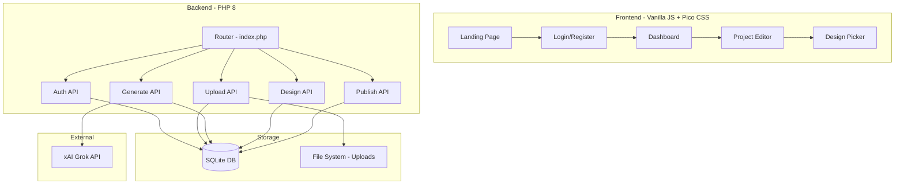
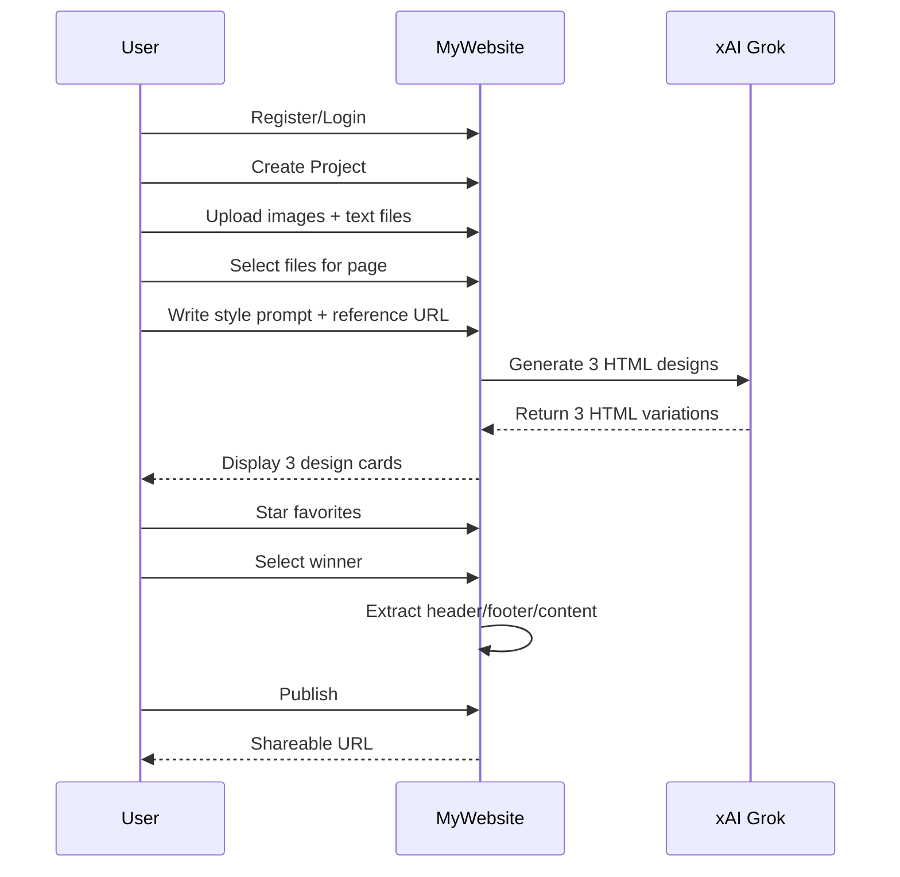

# MyWebsite - Portfolio Builder for Non-Technical Users

## Architecture Overview




## User Flow




## File Structure

```javascript
mywebsite/
├── index.php                 # Main router
├── config.php                # Configuration (API keys, paths)
├── init.php                  # Autoloader, session, helpers
│
├── database/
│   ├── mywebsite.sqlite      # SQLite database (created on init)
│   └── schema.sql            # Database schema
│
├── src/                      # PHP classes
│   ├── Database.php          # PDO singleton
│   ├── Auth.php              # Authentication helpers
│   ├── Project.php           # Project CRUD
│   ├── Upload.php            # File upload handling
│   ├── AI.php                # xAI API integration
│   └── PageBuilder.php       # Assemble header+content+footer
│
├── api/                      # API endpoints
│   ├── auth.php              # POST login/register/logout
│   ├── projects.php          # CRUD projects
│   ├── upload.php            # File upload handler
│   ├── generate.php          # AI generation
│   ├── designs.php           # Star/select designs
│   └── publish.php           # Publish project
│
├── pages/                    # PHP page templates
│   ├── landing.php           # Public landing page
│   ├── login.php             # Login form
│   ├── register.php          # Register form
│   ├── dashboard.php         # User's projects list
│   ├── project.php           # Project editor (upload + generate)
│   ├── portfolio.php         # Render published portfolio
│   └── 404.php               # Not found page
│
├── assets/
│   ├── css/
│   │   └── app.css           # Custom styles
│   └── js/
│       └── app.js            # Main JavaScript
│
└── storage/
    └── uploads/              # User uploaded files (gitignored)
```


## Database Schema

6 tables: `users`, `projects`, `uploads`, `generation_requests`, `designs`, `pages`, `project_templates`Key relationships:

- User has many Projects
- Project has many Uploads, Designs, Pages
- Project has one Template (header/footer/css)
- GenerationRequest groups 3 Designs together

---

## Implementation Steps

### Phase 1: Foundation (Files 1-5)

**1. config.php** - Configuration constants

- XAI API key, base URL
- Database path
- Upload directory path
- Allowed file types and sizes

**2. database/schema.sql** - Complete database schema

- All 7 tables with proper foreign keys
- Indexes for performance

**3. init.php** - Bootstrap file

- Session start
- Autoloader for src/ classes
- Helper functions (json_response, redirect, etc.)

**4. src/Database.php** - PDO singleton

- SQLite connection
- Auto-create database if not exists
- Run schema.sql on first run

**5. index.php** - Main router

- Parse URL path
- Route to pages/ or api/
- Handle portfolio URLs (parutkin.com/mywebsite/slug)

### Phase 2: Authentication (Files 6-9)

**6. src/Auth.php** - Auth helper class

- register(), login(), logout(), check(), user()
- Password hashing with password_hash()

**7. api/auth.php** - Auth API endpoint

- POST /api/auth.php?action=register
- POST /api/auth.php?action=login
- POST /api/auth.php?action=logout

**8. pages/login.php** - Login page

- Form with email/password
- AJAX submission
- Redirect to dashboard on success

**9. pages/register.php** - Register page

- Form with name/email/password
- AJAX submission
- Auto-login after register

### Phase 3: Project Management (Files 10-13)

**10. src/Project.php** - Project model

- create(), getByUser(), getById(), update(), delete()
- generateSlug() for unique URLs

**11. api/projects.php** - Projects API

- GET - list user's projects
- POST - create new project
- PUT - update project
- DELETE - delete project

**12. pages/dashboard.php** - Dashboard page

- List all user's projects as cards
- "New Project" button
- Quick stats (pages count, published status)

**13. pages/landing.php** - Public landing page

- Hero section with value proposition
- How it works (3 steps)
- CTA to register

### Phase 4: File Upload (Files 14-16)

**14. src/Upload.php** - Upload handler

- validate() - check file type/size
- store() - save to storage/uploads/{user}/{project}/
- createThumbnail() - for image previews
- getProjectFiles() - list all uploads for project

**15. api/upload.php** - Upload API

- POST - handle Dropzone.js uploads
- GET - list project files
- DELETE - remove file

**16. pages/project.php** - Project editor page

- Dropzone.js upload area
- File grid with selection checkboxes
- Style prompt textarea
- Reference URL input
- Generate button

### Phase 5: AI Generation (Files 17-19)

**17. src/AI.php** - xAI API integration

- buildPrompt() - construct prompt from files + user input
- generate() - call xAI API, return 3 HTML variations
- parseResponse() - extract HTML from API response
- analyzeReference() - describe reference URL for prompt

**18. api/generate.php** - Generation API

- POST - trigger AI generation
- Input: selected file IDs, prompt, reference URL
- Output: 3 design IDs
- Save to designs table with batch_id

**19. api/designs.php** - Designs API

- GET - list designs for project/page
- PUT - star/unstar design
- POST - select design as winner
- On select: extract header/footer, save to templates + pages

### Phase 6: Page Building (Files 20-22)

**20. src/PageBuilder.php** - Page assembly

- extractParts() - parse HTML into header/footer/content
- assemblePage() - combine template + content
- injectNavigation() - add nav links to header

**21. api/publish.php** - Publish API

- POST - set project as published
- Validate at least one page exists

**22. pages/portfolio.php** - Render published portfolio

- Load project by slug
- Load template (header/footer/css)
- Load requested page content
- Assemble and output

### Phase 7: Frontend Polish (Files 23-25)

**23. assets/css/app.css** - Complete stylesheet

- Pico CSS overrides
- Custom components (cards, dropzone, design picker)
- Animations
- Dark mode support

**24. assets/js/app.js** - Main JavaScript

- Dropzone initialization
- File selection toggle
- Design star/select handlers
- Form submissions
- Toast notifications

**25. pages/404.php** - Not found page

- Friendly error message
- Link back to home

---

## Key Implementation Details

### xAI API Integration

```php
// src/AI.php - generate() method
$response = file_get_contents('https://api.x.ai/v1/chat/completions', false, 
    stream_context_create([
        'http' => [
            'method' => 'POST',
            'header' => [
                'Content-Type: application/json',
                'Authorization: Bearer ' . XAI_API_KEY
            ],
            'content' => json_encode([
                'model' => 'grok-beta',
                'messages' => [
                    ['role' => 'system', 'content' => 'You are a web designer...'],
                    ['role' => 'user', 'content' => $prompt]
                ],
                'n' => 3  // Request 3 variations
            ])
        ]
    ])
);
```


### Header/Footer Extraction

```php
// src/PageBuilder.php - extractParts()
$dom = new DOMDocument();
@$dom->loadHTML($html, LIBXML_HTML5_QUIRKS);

$header = $dom->getElementsByTagName('header')->item(0);
$main = $dom->getElementsByTagName('main')->item(0);
$footer = $dom->getElementsByTagName('footer')->item(0);
$style = $dom->getElementsByTagName('style')->item(0);
```


### URL Routing Logic

```php
// index.php routing
$path = trim(parse_url($_SERVER['REQUEST_URI'], PHP_URL_PATH), '/');
$path = preg_replace('#^mywebsite/?#', '', $path);
$segments = $path ? explode('/', $path) : [];

// Known app routes vs portfolio slugs
$appRoutes = ['login', 'register', 'dashboard', 'project', 'api'];
if (empty($segments) || $segments[0] === '') {
    // Landing page
} elseif (in_array($segments[0], $appRoutes)) {
    // App page
} else {
    // Portfolio: check if slug exists in DB
}
```

---

## External Dependencies (CDN)

All loaded via CDN for speed:

- Pico CSS 2.x - classless CSS framework
- Lucide Icons - modern icon set
- Dropzone.js 5.x - file upload
- Toastify.js - notifications
- Google Fonts (Outfit) - typography

---

## Security Measures

1. Password hashing with `password_hash(PASSWORD_DEFAULT)`
2. Session-based auth with `session_regenerate_id()` on login
3. CSRF tokens on all forms
4. File upload validation (type, size, extension)
5. SQL injection prevention via prepared statements
6. XSS prevention via `htmlspecialchars()` on output
7. Project ownership verification on all API calls

---

## Estimated Build Time: ~45 minutes

| Phase | Files | Time ||-------|-------|------|| Foundation | 5 | 8 min || Auth | 4 | 7 min || Projects | 4 | 7 min || Upload | 3 | 8 min || AI Generation | 3 | 8 min || Page Building | 3 | 5 min |